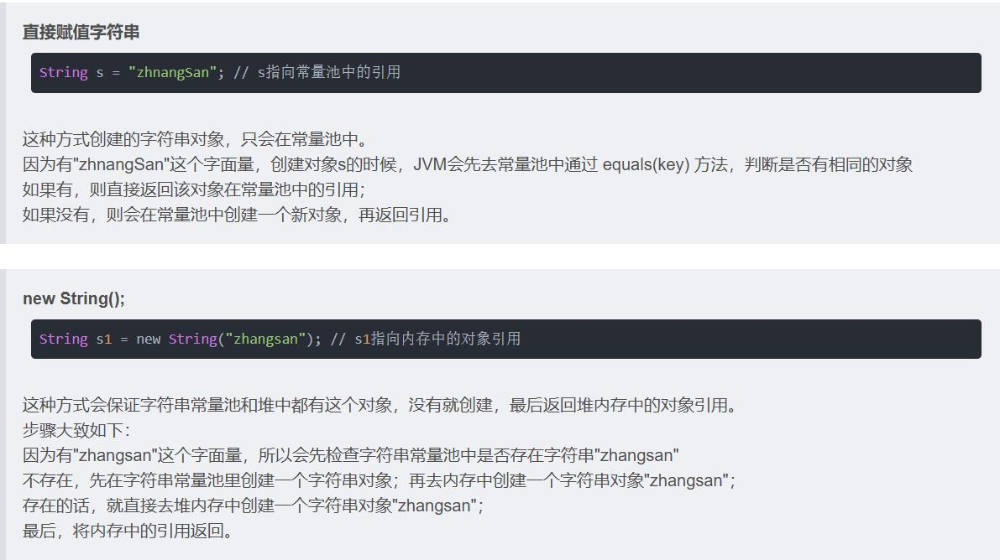
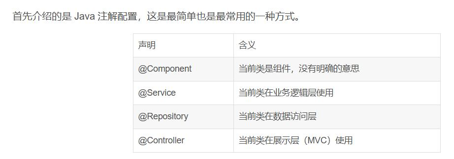
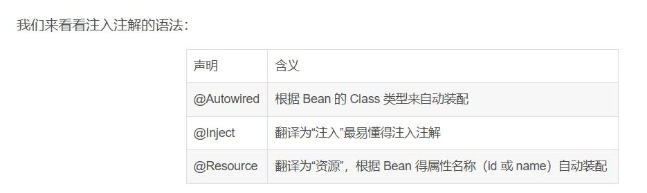

### 字符串常量池

设计思想：大量频繁地创建字符串，影响性能。JVM为提高性能和减少内存消耗，实例化字符串常量时进行了一些优化。

1. 为字符串开辟了一个字符串常量池，类似缓冲区；
2. 创建字符串常量时，首先查询字符串常量池是否存在该字符串；
3. 存在该字符串，返回引用实例，不存在，实例化该字符串并存入池中。



### java执行线程

`ThreadUtil.execAsync()` 和 `ThreadUtil.execute()` 都是 Hutool 提供的线程操作方法，它们都可以用来执行异步任务，但存在一些区别：

1. **返回值**：
   - `ThreadUtil.execAsync()` 方法执行异步任务，并返回一个 `Future` 对象，这个 `Future` 对象代表了异步操作的结果。通过这个 `Future` 对象，==可以查询异步操作是否完成，或者等待异步操作的结果==。
   - `ThreadUtil.execute()` 方法==直接在公共线程池中执行线程，没有返回值==，即不返回 `Future` 对象。
2. **异步操作的控制**：
   - 使用 `ThreadUtil.execAsync()` 时，可以通过返回的 `Future` 对象对异步操作进行==更多的控制，比如等待操作完成或者取消操作==。
   - `ThreadUtil.execute()` 方法则没有提供这样的控制机制，一旦提交任务，就无法通过返回值来查询或控制任务的执行。
3. **用途**：
   - 如果你需要对异步执行的任务进行==后续的查询或控制==，比如需要知道任务是否完成或者需要取消任务，那么 `ThreadUtil.execAsync()` 是更好的选择。
   - 如果你只是需要简单地异步执行一个任务，不需要后续的控制，那么 `ThreadUtil.execute()` 可能更加简单直接。

### Spring-Bean

1. Bean是对象，一个或多个不限定；
2. Bean由Spring中一个叫IoC的东西管理；
3. 我们的应用程序由一个个Bean构成。

控制反转（IoC）。==控制反转通过依赖注入（DI）方式实现对象之间的松耦合关系==。程序运行时，依赖对象由辅助程序动态生成并注入到被依赖对象中，动态绑定两者的使用关系。Spring IoC容器就是这样的辅助程序，==它负责对象的生产和依赖注入==，然后再交由我们使用。





Spring控制类构建过程：Spring启动时会把所需的类实例化对象，如果需要依赖，则==先实例化依赖，然后实例化当前类==。因为依赖必须通过构建函数传入，所以实例化时，当前类就会接收并保存所有依赖的对象。这一步也就是所谓的依赖注入。

IOC：在Spring中，类的实例化、依赖的实例化、依赖的注入都传入交由Spring Bean容器控制，而不是用new方法实例化对象、通过非构造函数方法传入依赖等常规方式。是值得控制权已经交由程序管理，而不是程序管理员，所以叫==控制反转==。

### Synchronized

```
public synchronized void test()
```

synchronized作用于静态方法上，锁住的对象为class，意味着方法的调用者无论是clss还是实例对象都可以保持互斥。

synchronized作用于方法上，则锁住的对象是调用的示例对象。

### 导入本地maven仓库

```
mvn install:install-file -Dfile=D:/work/resources/lib/xxx.jar -DgroupId=com.xxx -DartifactId=xxx -Dversion=2.0 -Dpackaging=jar
```

### Java中创建TestController做单元测试

 需要引入依赖

```
<dependency>
    <groupId>org.springframework.boot</groupId>
    <artifactId>spring-boot-starter-test</artifactId>
    <scope>test</scope>
</dependency>
```

引入依赖后，在/src后新增/test/java，之后在测试类前加入

```
@SpringBootTest(classes = QkrcDeviceManagementApplication.class)
```

之后进行测试，添加bean测试即可。

### maven打包过滤

```
<build>
  <resources>
    <resource>
      <directory>src/main/resources</directory>
      <filtering>true</filtering>
      <excludes>
        <exclude>**/*.br</exclude>
        <exclude>**/*.exe</exclude>
      </excludes>
    </resource>
  </resources>
</build>
```