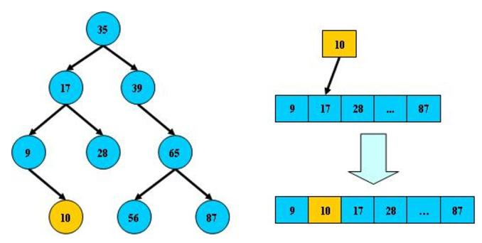
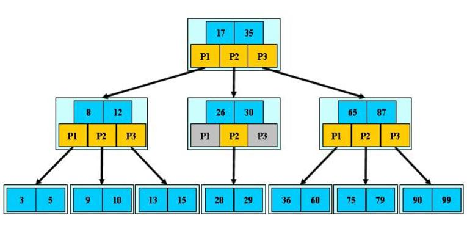
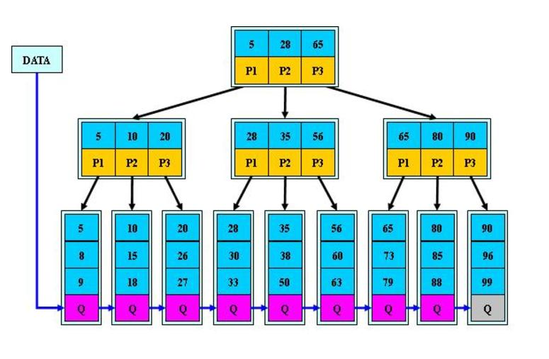

### B树、B-树和B+树

- B树（二叉搜索树）

1. 所有非叶子节点至多拥有两个节点；
2. 所有节点存储一个关键字；
3. 跟点关键字大于左子树根节点，小于右子树关键字。

如果B树所有非叶子结点的左右子树的结点数目保持差不多，那么B树搜索性能逼近二分查找；对比连续空间二分查找，优点在于，改变B树结构（插入和删除结点）不需要移动大段的内存数据，甚至通常是常数的开销。

- B-树（多路搜索树）

1. 非叶子节点最多只有M个节点，且M>2；
2. 根节点的孩子数为[2, M]；
3. 除根节点以外的非叶子节点孩子数为[M/2, M]；
4. 每个节点至少M/2-1（取上整）和至多M-1个关键字；（至少2个关键字）；
5. 非叶子节点的关键字个数=指向儿子的指针个数减1；
6. 非叶子节点的关键字：K[1], K[2], ......, K[M-1]，且K[i] < K[i+1]；
7. 非叶子结点的指针：P[1], P[2], ..., P[M];其中P[1]指向关键字小于 K[1]的。

B-树的特性：1.关键字集合分布在整棵树种；2.任何一个关键字出现且出现在一个结点中；3.搜索有可能在非叶子结点结束；4.其搜索性能等价于在关键字全集内做一次二分查找；5.自动层次控制，限制了除根节点以外的非叶子结点，至少含有M/2个儿子，确保了结点的至少利用率。指数。

- B+树（多路搜索树）

1. 定义基本与B-树相同，除了：非叶子结点的子树指针与关键字个数相同；
2. 非叶子节点的子树指针P[i]，指向关键字属于（K[i], K[i+1]）的子树（B-树是开区间）；
3. 为所有叶子结点增加一个链指针；
4. 所有关键字都在叶子结点出现；

